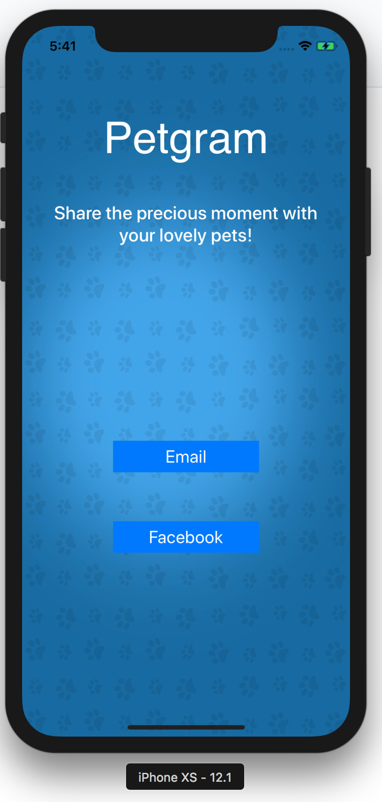
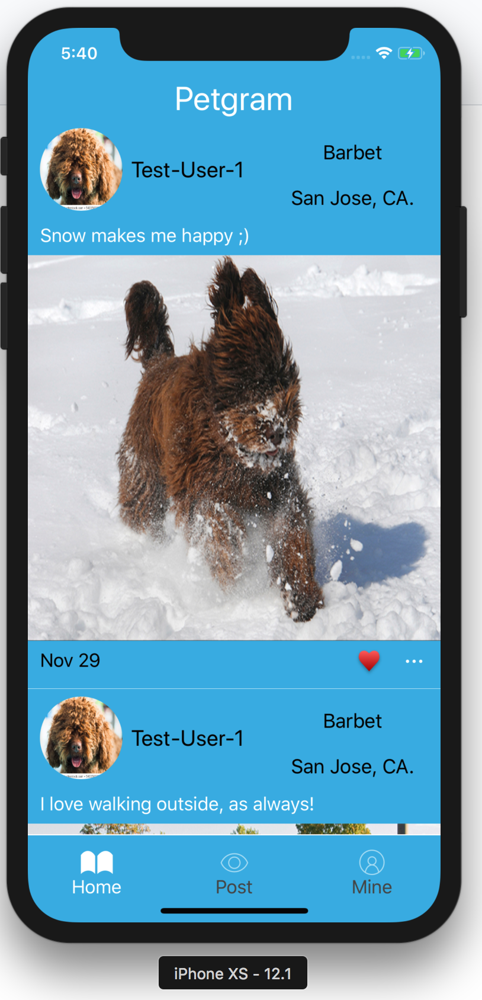
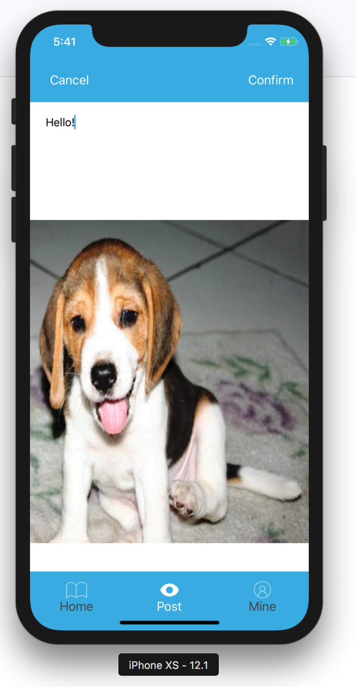
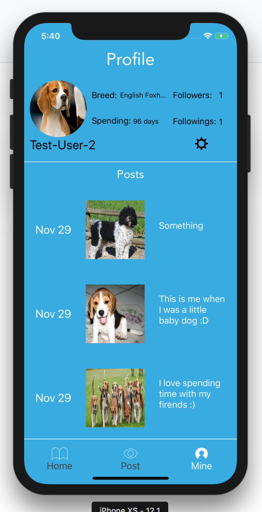
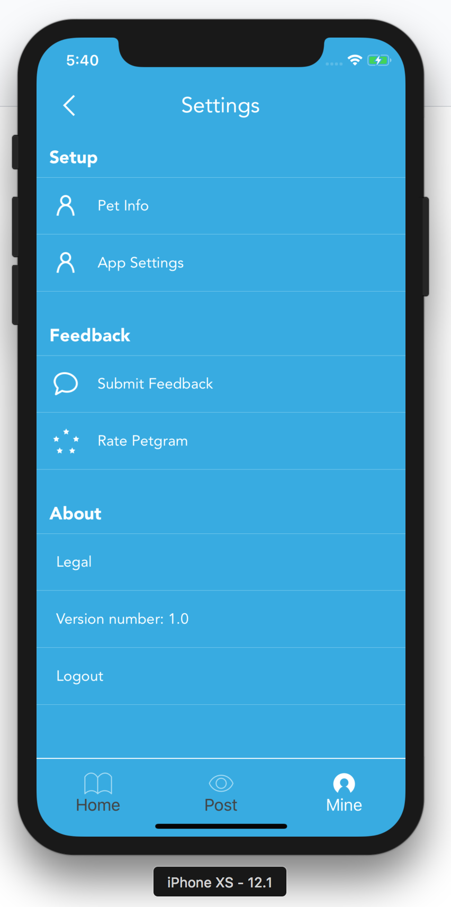
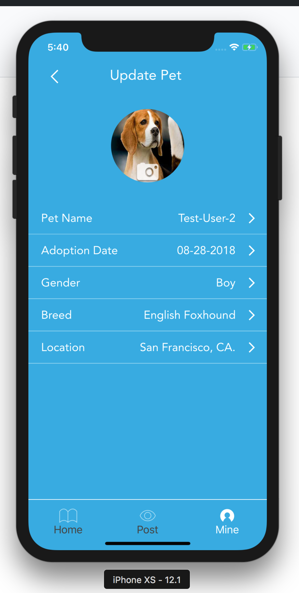
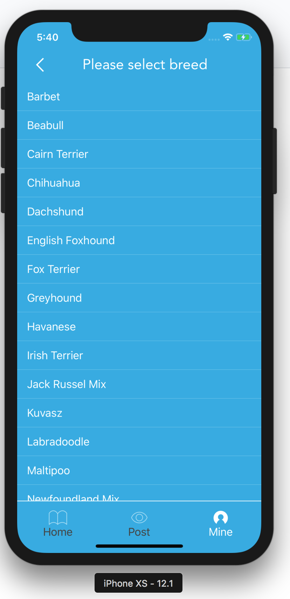
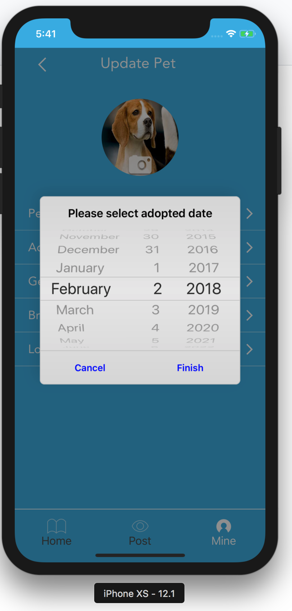

# Petgram 
## A Photo Sharing iOS Application for Pets!

### How to run? 
Download the source code and open it in [Xcode](https://developer.apple.com/xcode/) on your mac. For best UI displaying, select **IPhone Xs** as the simulator to run.

## How to test?
After opening the project in the Xcode, open the directory *PetgramTests* and click the **Run Test** button.

## Test Output
- White Box Test
[white-box-test-output.pdf](/white-box-test-output.pdf)

- Black Box Test
[black-box-test-output.pdf](/black-box-test-output.pdf)

## Screenshot
- Signup/Login Page

- Home Page 

- Post Page 

- Profile Page 

- Settings Page

- Edit Pet Info

- Change Pet Breed

- Change Pet Adoption Date

